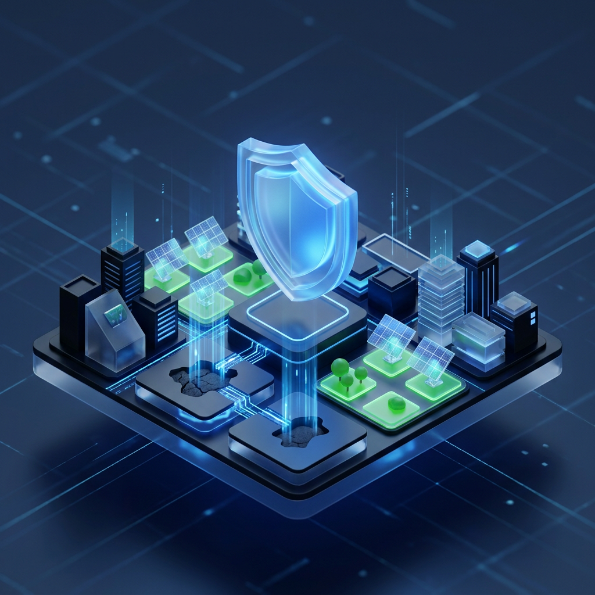
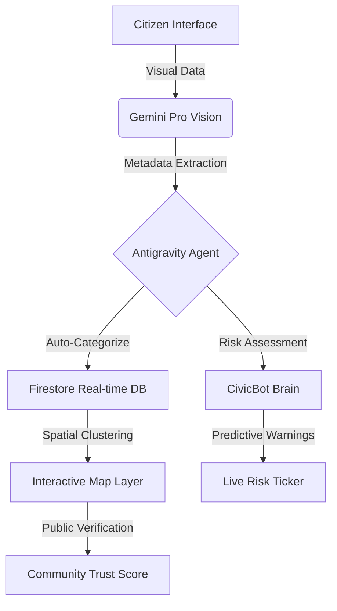

# 🛡️ CIVETRA
### **The Sovereign Civic Trust Engine**
*Visual Intelligence. Proactive Governance. Absolute Transparency.*

---

<p align="center">
  
</p>

<p align="center">
  <a href="#-core-vision">Vision</a> •
  <a href="#-feature-ecosystem">Features</a> •
  <a href="#-technical-architecture">Architecture</a> •
  <a href="#-security-posture">Security</a> •
  <a href="#-getting-started">Deployment</a>
</p>

<p align="center">
  
  
  
</p>

---

## 🏛️ Core Vision
**Civetra** is not just a reporting tool; it is a **Sovereign Trust Layer** for modern urbanity. It bridges the critical "trust deficit" between citizens and administration by using **Visual Intelligence** to turn subjective complaints into objective, actionable data. 

Built on the **Antigravity** agentic framework, Civetra automates the entire civic lifecycle—from the moment a citizen spots an issue to the final verification of its resolution.

---

## 💎 Feature Ecosystem

### 👁️ **The Civic Lens (Multi-Modal AI)**
*Powered by Google Gemini Pro Vision*
- **Autonomous Triage**: Point your camera, and the AI instantly generates category, severity, and urgency levels.
- **Visual Validation**: Real-time filtering prevents off-topic noise, ensuring the platform remains dedicated to infrastructure.
- **Smart Metadata**: GPS and timestamp embedding creates a "Single Source of Truth" for every report.

### 🧠 **CivicBot: The Intelligent Guardian**
*Powered by Google Gemini Flash*
- **Contextual Assistance**: A high-EQ AI agent that guides users through complex civic processes.
- **Predictive Risk Engine**: A live ticker that analyzes community data to forecast infrastructure failures before they happen.
- **Real-Time Synthesis**: Automatically summarizes hundreds of reports into actionable "Executive Briefs" for officials.

### 📱 **Apple-Grade Installation (PWA)**
- **Native Performance**: Fully installable on iOS, Android, and Desktop with zero friction.
- **Offline Resilience**: Service Workers allow reporting even in low-connectivity "dead zones."
- **Obsidian Design System**: A premium, Glassmorphic UI optimized for both bright sunlight and low-light operations.

---

## 🏗️ Technical Architecture



---

## 🛡️ Security Posture
Civetra is engineered with **Zero-Leakage Architecture**. We adhere to the highest industry standards for data privacy and credential management.

- **Strict Environment Separation**: 100% of API keys and secrets are managed via `import.meta.env` and server-side `process.env`.
- **Credential Rotation**: All cloud services (Firebase, TomTom, Gemini) are restricted by domain and IP to prevent unauthorized use.
- **Zero Hardcoded Secrets**: Our repository is regularly scrubbed to ensure no cryptographic material ever touches the source control.

---

## 📦 Getting Started

### 1. Repository Setup
```bash
git clone https://github.com/parakhpratyush/Civetra.git
cd Civetra
```

### 2. Environment Configuration
Create a `.env` file in the root directory. Use [.env.example](file:///D:/MY%20WORK/hackethon/antigravity/civetra-perfect/.env.example) as a template.

```properties
VITE_FIREBASE_API_KEY=your_key
VITE_TOMTOM_API_KEY=your_key
GEMINI_API_KEY=your_key
```

### 3. Execution
```bash
npm install
npm run dev
```

---

## 🏆 Project Recognition
*Built for the **vibe2ship Hackathon** as a showcase of the next generation of Agentic Civic Technology.*

<p align="right">
  <sub>Managed with 💙 by the Civetra Core Team.</sub>
</p>
